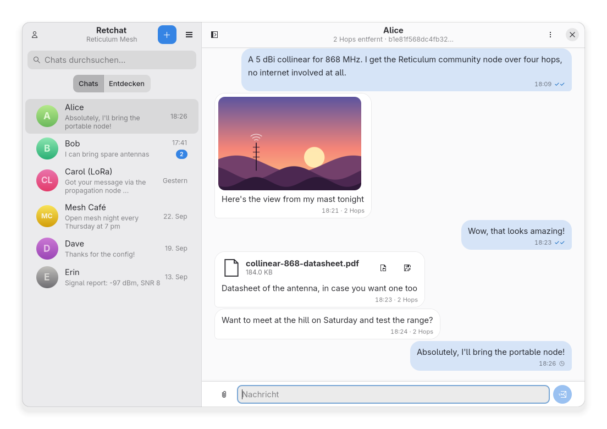
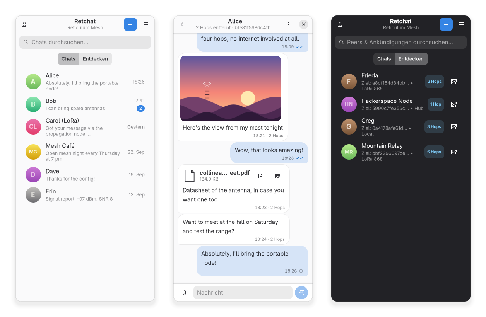
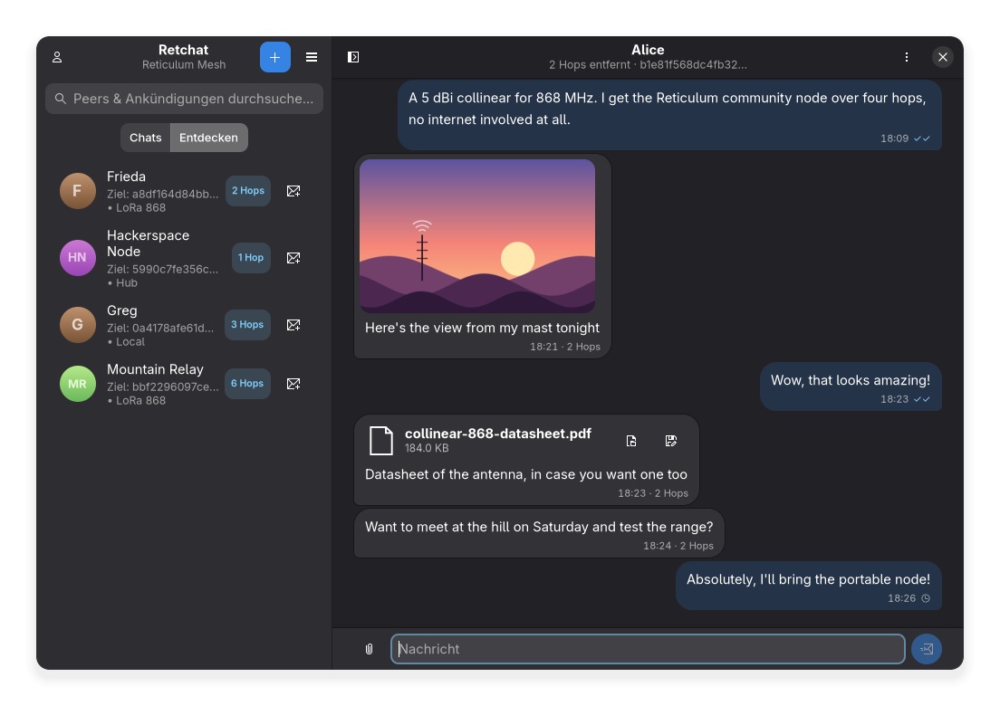

<p align="center">
  
</p>

# Retchat

**Retchat** is a desktop and mobile chat client for the [Reticulum Network](https://reticulum.network/), built with **GTK4 and Libadwaita** and inspired by the Android app [Columba](https://github.com/torlando-tech/columba).

Chat without servers and end-to-end encrypted over the Reticulum mesh using [LXMF](https://github.com/markqvist/LXMF), over Wi-Fi, TCP, LoRa radio (RNode) and local interfaces. Retchat runs on the desktop as well as on Linux phones such as the PinePhone or Librem 5 with postmarketOS and Phosh.

The icon is a speech bubble shaped like a ratchet wheel – Retchat, ratchet.



<p align="center">
  
</p>



<sub>Screenshots use dummy data and are generated with `data/screenshots/generate_screenshots.py`.</sub>

---

## Features

- **Direct messages over LXMF**
  - Live delivery status for sent messages: sending, sent to a propagation node (✓), delivered (✓✓), failed.
  - Rename contacts, copy their address, request a path through the mesh.
  - Delete chats from the chat menu, or by right click / long press in the chat list.
- **Images and files**
  - Images are downscaled before sending and shown inline, with a built-in image viewer.
  - Send any other file up to 900 KB (LXMF receivers accept 1000 KB per message by default). Files above 256 KB
    can only be delivered directly, not via propagation nodes – Retchat points this out before sending.
  - Received files show their type, name and size and can be opened or saved. Executables and scripts can only be
    saved, not opened directly.
  - Works with attachments from other LXMF clients (file attachments, images, voice messages).
- **Discover peers on the mesh**
  - The *Entdecken* (discover) tab lists `lxmf.delivery` announces with display name, address and hop count.
  - Start a chat with a single click.
- **Message sync**
  - Fetch messages that were stored for you on an LXMF propagation node while you were offline (main menu → *Nachrichten synchronisieren*).
- **Identity and interfaces**
  - Set your display name, copy your LXMF address and identity hash, announce yourself on the mesh.
  - Overview of all Reticulum interfaces (TCP, AutoInterface, RNode/LoRa) with status and traffic; configure the TCP hub and the propagation node.
- **Made for phones and desktops**
  - Adaptive layout via `Adw.Breakpoint`: on narrow screens (down to 360 px) sidebar and chat become separate pages with a back button.
  - Native light and dark style, GNOME HIG compliant.
  - The chat always keeps the newest message in view – also when the on-screen keyboard opens or several messages arrive at once.
  - Desktop notifications for incoming messages.

> The user interface is currently in German.

---

## Installation

Prebuilt Flatpak bundles are created with the build script (see below).

### Linux phone (aarch64, e.g. postmarketOS with Phosh)

```bash
scp retchat-aarch64.flatpak user@phone:~/
# on the phone:
flatpak install --user ~/retchat-aarch64.flatpak
```

### Desktop (x86_64)

```bash
flatpak install --user retchat.flatpak
```

Both bundles use the runtime `org.gnome.Platform//50`, which Flatpak installs from Flathub if needed.

To update, install the new bundle into the **same** installation (`--user` or `--system`) as before, otherwise two installations exist side by side and the older one may keep being started.

### Run from source

Requires Python 3, GTK 4.12+, Libadwaita 1.5+ and PyGObject, plus the Python packages from `setup.py` (`rns`, `lxmf`, `nomadnet`, …):

```bash
python3 -m venv --system-site-packages .venv
.venv/bin/pip install -e .
./retchat.sh
```

---

## Building the Flatpaks

```bash
./build-flatpak.sh            # x86_64 (flatpak-builder)
./build-flatpak.sh --aarch64  # aarch64, without QEMU/binfmt
./build-flatpak.sh --all      # both
```

The aarch64 bundle is cross-packaged by `build_aarch64_bundle.py`: it downloads prebuilt aarch64 wheels from PyPI and assembles the Flatpak without emulation.

---

## Where data is stored

Retchat uses [NomadNet](https://github.com/markqvist/NomadNet) as its LXMF backend. On the same machine, Retchat and NomadNet therefore **share identity, contacts and messages**.

| Path | Content |
|---|---|
| `~/.nomadnetwork/storage/identity` | Your Reticulum identity (private key) |
| `~/.nomadnetwork/storage/conversations/` | Messages |
| `~/.nomadnetwork/storage/attachments/` | Images and files of received and sent messages |
| `~/.nomadnetwork/config` | NomadNet settings, e.g. announce interval (default: at start and every 6 hours) |
| `~/.reticulum/config` | Reticulum interfaces; on first start Retchat makes sure a TCP interface is configured |
| `~/.local/share/retchat/retchat.db` | Retchat's own data: custom contact names and settings |

---

## Project structure

```text
retchat/
├── org.selfmade.Retchat.json          # Flatpak manifest (x86_64)
├── build-flatpak.sh                   # Flatpak build script
├── build_aarch64_bundle.py            # aarch64 cross-packager
├── org.selfmade.Retchat.metainfo.xml  # AppStream metadata
├── org.selfmade.Retchat.desktop       # Desktop entry (desktop and mobile form factor)
├── setup.py                           # Python package definition
├── main.py / retchat.sh               # Entry point / local launcher
├── data/icons/
│   ├── generate_icon.py               # Generates the app icon (ratchet-wheel speech bubble)
│   └── hicolor/                       # Scalable and symbolic app icon
├── data/screenshots/
│   └── generate_screenshots.py        # Renders the README screenshots with dummy data (headless)
└── retchat/
    ├── app.py                         # Adw.Application: lifecycle, CSS, icons, about dialog
    ├── window.py                      # Main window (split view, breakpoints, menus, actions)
    ├── models.py                      # GObject model for messages (MessageItem)
    ├── database.py                    # SQLite store for custom names and settings
    ├── reticulum_service.py           # Reticulum / LXMF / NomadNet service and callbacks
    ├── style.css                      # Libadwaita CSS (bubbles, badges, composer)
    ├── widgets/
    │   ├── chat_history.py            # Gtk.ListView history that keeps the newest message in view
    │   ├── chat_view.py               # Direct chat: history and composer
    │   ├── message_bubble.py          # Message bubble with image, files and delivery status
    │   ├── attachment_row.py          # File attachment row (open / save) and file helpers
    │   ├── conversation_row.py        # Row in the chat list
    │   └── announce_row.py            # Row in the discover list
    └── dialogs/
        ├── new_chat_dialog.py         # New chat (address input with validation)
        ├── profile_dialog.py          # Own profile and announce
        ├── interfaces_dialog.py       # Reticulum interfaces, TCP hub, propagation node
        └── image_viewer_dialog.py     # Image viewer
```

---

## Tested with

- Flatpak runtime `org.gnome.Platform//50` (GTK 4, Libadwaita 1.9)
- Reticulum 1.5.4, LXMF 1.1.1, NomadNet 1.4.3
- Phosh / narrow windows down to 360 px width

---

## License

GPL-3.0-or-later, see [LICENSE](LICENSE).
